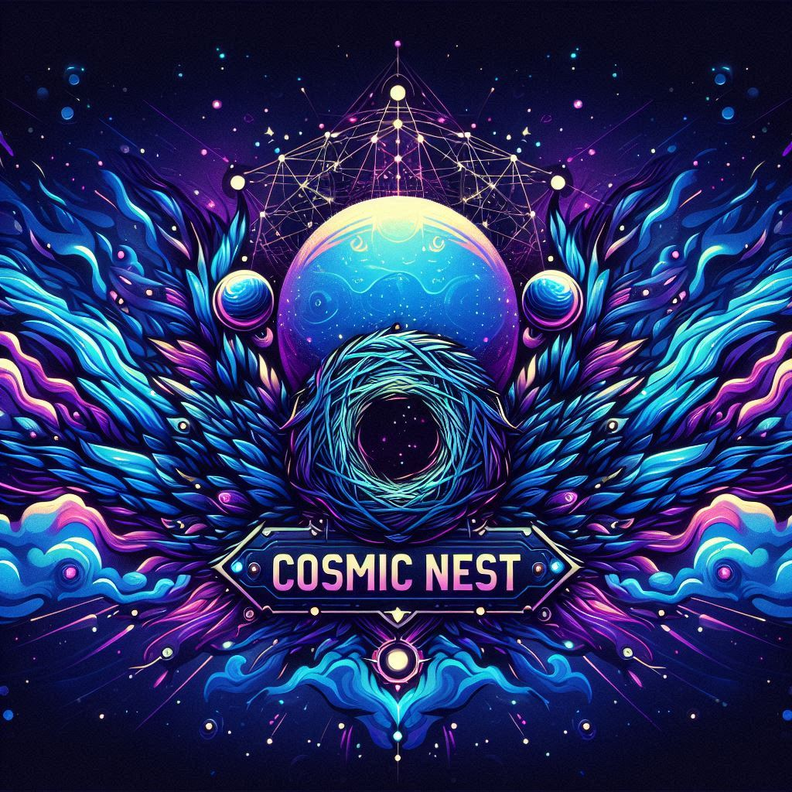

# Cosmic Nest Archivist
*A custom-made Discord archiving system for Cosmic Nest.*

  

## Current Version
Current development version: `v1.2a`
This version adds Cosmic Nest themed online/offline HTML transcript generation, archive metadata, and development run folders for testing.

## Origin and Attribution
Cosmic Nest Archivist began as a fork of `sofiadparamo/discord-channel-archiver`, a simple Discord channel archiving bot.
Since then, this project has been heavily expanded and redesigned for the Cosmic Nest Discord server. It now includes custom archive folder handling, safer filename handling, attachment retry logic, zip output, error logging, archive metadata, and Cosmic Nest themed HTML transcript generation.
The current project is maintained as a custom archival system for Cosmic Nest.

## License Status
This project is currently under active development and does not yet have a finalized public license.
Cosmic Nest specific branding, transcript styling, custom bot responses, and server-specific workflows are not intended for reuse without permission.
A clearer license and branding policy will be added before any stable public release.